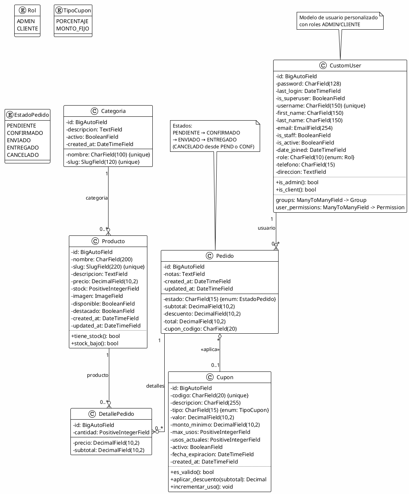
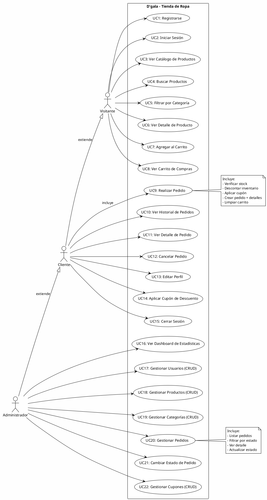
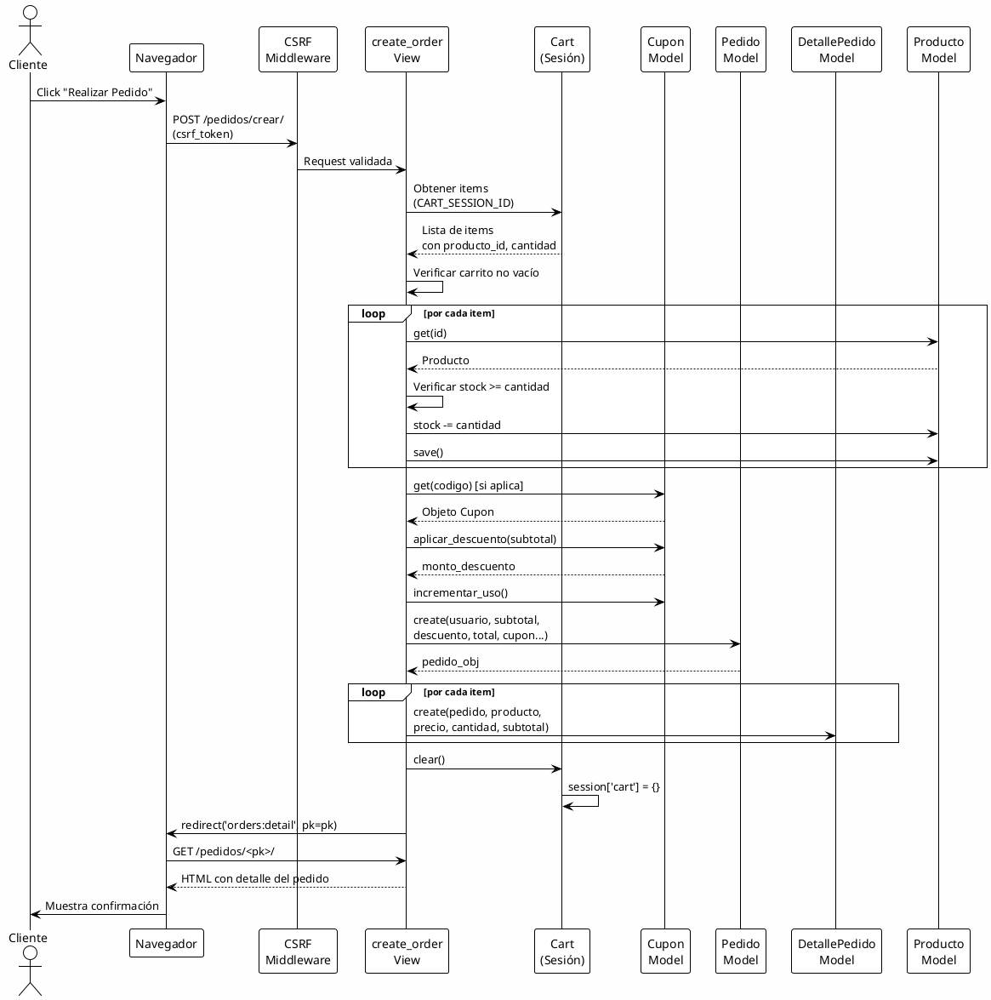
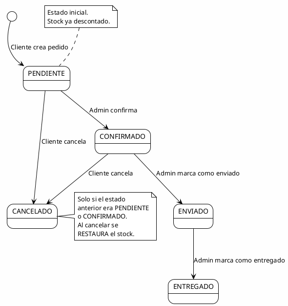

# D'gala — Arquitectura y Modelado UML (PlantUML)

Este archivo contiene diagramas PlantUML que modelan la arquitectura del sistema.  
Puedes renderizarlos en: https://www.plantuml.com/plantuml/uml/ o usando la extensión PlantUML en VS Code.

---

## 1. Diagrama de Clases (Modelo de Datos)



---

## 2. Diagrama de Componentes (Arquitectura del Sistema)

```plantuml
@startuml Dgala_Arquitectura
!theme plain
skinparam backgroundColor #FEFEFE
skinparam componentStyle rectangle

' ============================================================================
' CAPA DE PRESENTACION
' ============================================================================
package "Capa de Presentación" as Presentacion {
    [base.html] as BaseHTML
    [style.css] as CSS
    [script.js] as JS
    [Bootstrap 5] as BS5

    package "Plantillas Públicas" as PubTemplates {
        [product_list.html]
        [product_detail.html]
        [category_list.html]
        [cart_detail.html]
        [order_list.html]
        [order_detail.html]
    }

    package "Plantillas Admin" as AdminTemplates {
        [base_admin.html]
        [home.html]
        [user_list.html]
        [user_form.html]
        [product_list.html]
        [product_form.html]
        [category_list.html]
        [category_form.html]
        [order_list.html]
        [order_detail.html]
        [coupon_list.html]
        [coupon_form.html]
        [confirm_delete.html]
    }

    BaseHTML --> PubTemplates : extiende
    BaseHTML --> AdminTemplates : extiende
    PubTemplates --> CSS
    PubTemplates --> JS
    PubTemplates --> BS5
    AdminTemplates --> CSS
    AdminTemplates --> JS
    AdminTemplates --> BS5
}

' ============================================================================
' CAPA DE APLICACION (LOGICA DE NEGOCIO)
' ============================================================================
package "Capa de Aplicación (Apps Django)" as Aplicacion {
    [accounts] as Accounts
    [products] as Products
    [cart] as Cart
    [orders] as Orders
    [dashboard] as Dashboard

    package "Middleware" as MW {
        [NoCacheMiddleware]
        [SecurityMiddleware]
        [SessionMiddleware]
        [CsrfViewMiddleware]
        [AuthMiddleware]
        [MessageMiddleware]
        [XFrameOptionsMiddleware]
    }

    package "Context Processors" as CP {
        [categorias_globales]
        [cart_items_count]
    }
}

' ============================================================================
' CAPA DE RUTEO
' ============================================================================
package "Enrutamiento (urls.py)" as Routing {
    [config/urls.py] as RootURL
    [accounts/urls.py] as AccURL
    [products/urls.py] as ProdURL
    [cart/urls.py] as CartURL
    [orders/urls.py] as OrdURL
    [dashboard/urls.py] as DashURL
}

' ============================================================================
' CAPA DE DATOS
' ============================================================================
package "Capa de Datos" as Datos {
    database "SQLite\ndb.sqlite3" as DB
    file_system "media/\n(Imágenes)" as Media
    database "Sesiones\n(DB Backend)" as Sessions
}

' ============================================================================
' CONEXIONES ENTRE CAPAS
' ============================================================================
RootURL --> AccURL : /cuenta/
RootURL --> ProdURL : /productos/
RootURL --> CartURL : /carrito/
RootURL --> OrdURL : /pedidos/
RootURL --> DashURL : /panel/

AccURL --> Accounts
ProdURL --> Products
CartURL --> Cart
OrdURL --> Orders
DashURL --> Dashboard

Accounts --> MW : pasa por
Products --> MW
Cart --> MW
Orders --> MW
Dashboard --> MW

Accounts --> CP
Products --> CP
Cart --> CP
Orders --> CP
Dashboard --> CP

Accounts --> DB : CRUD CustomUser
Products --> DB : CRUD Categoria/Producto
Cart --> DB : Cupon
Cart --> Sessions : carrito en sesión
Orders --> DB : CRUD Pedido/DetallePedido
Dashboard --> DB : CRUD todo
Dashboard --> Products : estadísticas

Products --> Media : leer/escribir imágenes

' CLIENTE
actor Usuario as U
U --> RootURL : HTTP Request
RootURL --> U : HTTP Response (HTML)

@enduml
```

---

## 3. Diagrama de Casos de Uso



---

## 4. Diagrama de Secuencia — Creación de Pedido



---

## 5. Diagrama de Estados — Ciclo de Vida del Pedido



---

## 6. Diagrama de Paquetes — Estructura Django

```plantuml
@startuml Dgala_Paquetes
!theme plain
skinparam backgroundColor #FEFEFE
skinparam packageStyle rectangle

package "ropa_shop" as ROOT {
    package "config" as Config {
        [settings.py] as Settings
        [urls.py] as URLs
        [wsgi.py] as WSGI
        [asgi.py] as ASGI
    }

    package "apps" as Apps {
        package "accounts" as Acc {
            [models.py] as AccModels
            [views.py] as AccViews
            [forms.py] as AccForms
            [urls.py] as AccUrls
            [middleware.py] as AccMW
            [decorators.py] as AccDec
            [admin.py] as AccAdmin
            [seed_data.py] as Seed
        }

        package "products" as Prod {
            [models.py] as ProdModels
            [views.py] as ProdViews
            [forms.py] as ProdForms
            [urls.py] as ProdUrls
            [admin.py] as ProdAdmin
            [context_processors.py] as ProdCP
        }

        package "cart" as Cart {
            [models.py] as CartModels
            [views.py] as CartViews
            [forms.py] as CartForms
            [urls.py] as CartUrls
            [cart.py] as CartLogic
            [admin.py] as CartAdmin
            [context_processors.py] as CartCP
        }

        package "orders" as Ord {
            [models.py] as OrdModels
            [views.py] as OrdViews
            [forms.py] as OrdForms
            [urls.py] as OrdUrls
            [admin.py] as OrdAdmin
        }

        package "dashboard" as Dash {
            [views.py] as DashViews
            [urls.py] as DashUrls
        }
    }

    package "templates" as Templates {
        [base.html]
        package "products/" as TProd
        package "cart/" as TCart
        package "orders/" as TOrd
        package "dashboard/" as TDash
    }

    package "static" as Static {
        package "css/" as CSS
        package "js/" as JS
        package "bootstrap/" as BS
    }
}

' Dependencias entre módulos
AccViews ..> AccModels : usa
AccViews ..> AccForms : usa
AccUrls ..> AccViews : enruta

ProdViews ..> ProdModels
ProdViews ..> ProdForms
ProdUrls ..> ProdViews
ProdCP ..> ProdModels

CartViews ..> CartLogic
CartViews ..> CartModels
CartViews ..> CartForms
CartUrls ..> CartViews
CartCP ..> CartLogic

OrdViews ..> OrdModels
OrdViews ..> OrdForms
OrdUrls ..> OrdViews

DashViews ..> AccModels
DashViews ..> ProdModels
DashViews ..> OrdModels
DashViews ..> CartModels
DashUrls ..> DashViews

' Context processors inyectados en templates
ProdCP ..> Templates : categorias_globales
CartCP ..> Templates : cart_items_count

' URLs raíz enrutan a sub-urls
URLs ..> AccUrls : /cuenta/
URLs ..> ProdUrls : /productos/
URLs ..> CartUrls : /carrito/
URLs ..> OrdUrls : /pedidos/
URLs ..> DashUrls : /panel/

' Templates heredan
Templates <.. TProd : extiende
Templates <.. TCart
Templates <.. TOrd
Templates <.. TDash

' Static usado por templates
Templates ..> CSS
Templates ..> JS
Templates ..> BS

@enduml
```



---

## Instrucciones de Uso

1. Copia cualquier bloque `@startuml ... @enduml` en un archivo `.puml`.
2. Abre el archivo en:
   - **VS Code**: Extensión "PlantUML" (jebbs.plantuml).
   - **Web**: https://www.plantuml.com/plantuml/uml/
   - **CLI**: `plantuml archivo.puml` (requiere Java y PlantUML).
3. Los diagramas se renderizarán como imágenes SVG/PNG.

### Diagramas incluidos

| Diagrama | Archivo PlantUML | Descripción |
|----------|-----------------|-------------|
| Clases | `diagrama_clases.puml` | Modelo de datos completo con 6 entidades, relaciones, tipos y métodos |
| Componentes | `diagrama_componentes.puml` | Arquitectura por capas (presentación, aplicación, ruteo, datos) |
| Casos de Uso | `diagrama_casos_uso.puml` | 22 casos de uso distribuidos en 3 roles (visitante, cliente, admin) |
| Secuencia | `diagrama_secuencia_pedido.puml` | Flujo completo de creación de pedido con 7 participantes |
| Estados | `diagrama_estados_pedido.puml` | Ciclo de vida del pedido con 5 estados y transiciones |
| Paquetes | `diagrama_paquetes.puml` | Estructura de módulos Python y dependencias entre componentes |
